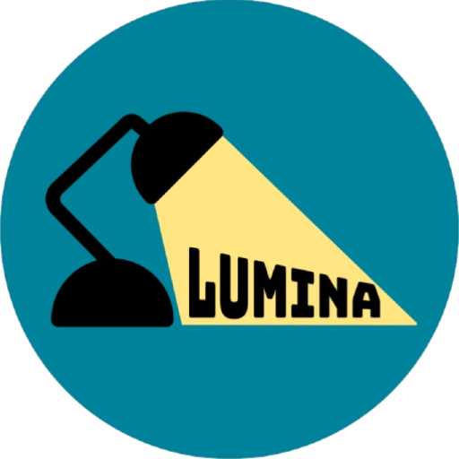

# Radar Cidadão 🕵️ <a id="topo"></a>

<p align="center">
      
      <h2 align="center">Lumina </h2>
</p>

<p align="center">
  <a href="#desafio">Desafio</a> | 
  <a href="#backlog">Backlog</a> | 
  <a href="#dor">DoR</a> | 
  <a href="#dod">DoD</a> | 
  <a href="#sprint">Cronograma</a> | 
  <a href="#tecnologias">Tecnologias</a> | 
  <a href="#execucao">Como Executar</a> | 
  <a href="#equipe">Equipe</a> | 
  <a href="#professores">Professores</a>
</p>

<br>

> **Status do Projeto:** Aguardando entrega da Sprint 1 🕒

---

## 🏅 Desafio <a id="desafio"></a>

O projeto **Radar Cidadão** surge da necessidade de tornar a democracia mais acessível através da transparência de dados. O foco central é a análise de desempenho dos Deputados Federais que buscam a reeleição, utilizando como fonte a API pública da Câmara dos Deputados.

### 1. Contexto
Em outubro de 2026, ocorrerão as eleições para Deputado Federal. Embora os dados sobre presença, gastos e atividades parlamentares sejam públicos, eles se apresentam de forma técnica, dispersa e de difícil interpretação para a maioria da população. Nosso objetivo é transformar essa complexidade em informação clara e útil.

---

### 2. Dores do Parceiro
Para garantir que a solução seja funcional, focamos em três perfis de usuários (Personas) identificados pelo parceiro:

<details open><summary><b>Educação (Profª Ana Lúcia):</b></summary> Necessidade de ensinar cidadania baseada em fatos e dados neutros, mas falta de ferramentas que organizem o desempenho dos candidatos de forma estruturada.</details>
<br>
<details open><summary><b>Jornalismo (Carlos Menezes):</b></summary> Necessidade de avaliar rapidamente o desempenho de deputados estaduais em busca de reeleição, enfrentando o desafio de dados complexos e espalhados.</details>
<br>
<details open><summary><b>Cidadania (Dona Maria):</b></summary> Desejo de votar com consciência, mas sente falta de uma síntese simples e objetiva para decidir se deve ou não reconduzir seu representante.</details>

---

### 3. Problema Central
Atualmente, eleitores e educadores não possuem ferramentas simples e neutras para avaliar o desempenho de deputados federais candidatos à reeleição.
> **Pergunta Investigativa:** Como o desempenho dos deputados do meu estado dá valor à sua candidatura e como se compara a média nacional? 

---

<br>

## 🗺️ Roadmap

<p align="center">
  <pre>
       SPRINT 1                          SPRINT 2                          SPRINT 3
  [Foco: Fundação]                  [Foco: Exploração]               [Foco: Refinamento]
          |                                 |                                 |
   18/03 a 05/04                     13/04 a 03/05                     11/05 a 31/05
          |                                 |                                 |
  ● Landing Page Inicial            ● Perfil do Deputado              ● UX Responsivo (Mobile)
  ● Gráficos de Validação           ● Fotos & Identificação           ● Tabelas Roláveis
  ● Análise no Colab                ● Filtros por Estado/Nome         ● Tratamento de Erros (404)
  ● Pergunta Investigativa          ● Dashboard de Gastos             ● Legendas Educativas
  ● Estrutura Flask                 ● Nuvem de Palavras (Discursos)   ● Fontes e Referências
          |                                 |                                 |
       ENTREGA:                          ENTREGA:                          ENTREGA:
   Dados Tratados &                  Banco MariaDB &                   Sistema Final &
   Esboço de Interface               Busca Avançada                    Manuais Técnicos
  </pre>
</p>

---

<br>
<p align="right"><a href="#topo">↑ Voltar ao topo</a></p>

## 📋 Backlog do Produto <a id="backlog"></a>

O Backlog do Produto representa a lista de todas as funcionalidades e entregas planejadas para o projeto **Radar Cidadão**, priorizadas de acordo com o valor entregue ao cidadão.


<details><summary>ℹ️ Legenda</summary>
&nbsp;&nbsp;🔴 Não iniciado <br> &nbsp;&nbsp;🟡 Em andamento <br> &nbsp;&nbsp;🟢 Concluído <br> &nbsp;&nbsp;★ Meta
</details>

| RANK | PRIORIDADE | USER STORY | STATUS | SPRINT |
| :---: | :---: | :--- | :---: | :---: |
| 1 | Alta <sup>★</sup> | Como usuário, quero acessar uma página inicial simples e intuitiva para entender o propósito do projeto. | 🟢 | 1 |
| 2 | Alta <sup>★</sup> | Como professor, gostaria de visualizar gráficos preliminares sobre os gastos e presença dos deputados para validar se os dados são úteis para minhas aulas de cidadania. | 🟢 | 1 |
| 3 | Alta | Como eleitor, gostaria de uma página dedicada aos deputados e suas informações básicas, organizada com filtros para que eu não me perca. | 🔴 | 2 |
| 4 | Alta | Como eleitor, quero ver fotos dos deputados no site para os identificar mais facilmente. | 🔴 | 2 |
| 5 | Alta | Como eleitor, quero uma barra de pesquisa por nome para encontrar um deputado específico rapidamente. | 🔴 | 2 |
| 6 | Alta | Como eleitor, quero ver com o que o meu deputado está gastando para analisar e avaliar se a despesa é necessária. | 🔴 | 2 |
| 7 | Alta | Como jornalista, quero filtrar deputados por estado para analisar o desempenho da bancada regional. | 🔴 | 2 |
| 8 | Alta | Como professor, quero poder acessar as palavras-chave mais frequentes nos discursos dos deputados para ensinar cidadania e constituição. | 🔴 | 2 |
| 9 | Alta | Como eleitor, quero ver dados com linguagem simples e de forma resumida do desempenho do meu deputado para decidir meu voto. | 🔴 | 2 |
| 10 | Alta | Como usuário, quero uma página de erro caso procure por um deputado inexistente. | 🔴 | 3 |
| 11 | Alta | Como professor, quero ver legendas explicativas nos gráficos (ex.: o que é "cota parlamentar" etc). | 🔴 | 3 |
| 12 | Média | Como usuário, quero saber de onde são as fontes utilizadas no levantamento dos dados. | 🔴 | 3 |
| 13 | Alta | Como usuário de smartphone, quero que as tabelas de dados sejam roláveis lateralmente para não quebrar o layout. | 🔴 | 3 |

---

<br>
<p align="right"><a href="#topo">↑ Voltar ao topo</a></p>

## 🏃‍♂️ DoR - Definition of Ready <a id="dor"></a>
Para que uma tarefa seja considerada pronta para iniciar (Ready), ela deve possuir:
* **Descrição clara:** Explicação da funcionalidade e do que ela entrega.
* **Critérios de aceitação:** Regras que definem quando a tarefa funcionou.
* **Dados identificados:** Saber quais informações da API serão usadas.
* **Prazo e Prioridade:** Definição de data limite e importância da tarefa.

## 🏆 DoD - Definition of Done <a id="dod"></a>
Uma tarefa é considerada concluída (Done) quando:
* **Padronização:** O código segue os padrões de commit
* **Estabilidade:** A funcionalidade foi testada e está funcionando na branch `main`.
* **Documentação:** O arquivo README ou manuais técnicos foram atualizados.
* **Aprovação Final:** A entrega foi validada e aprovada pelo Product Owner (PO).

<br>
<p align="right"><a href="#topo">↑ Voltar ao topo</a></p>

## 📅 Cronograma<a id="sprint"></a>

O projeto está dividido em três Sprints, seguindo a metodologia ágil Scrum. O progresso atual é atualizado ao final de cada ciclo.

<details><summary>ℹ️ Legenda</summary>
&nbsp;&nbsp;📅 Planejado <br> &nbsp;&nbsp;🕒 Em andamento <br> &nbsp;&nbsp;🟢 Concluída
</details>

| Sprint | Período | Documentação | Status |
| :---: | :---: | :---: | :---: |
| **01** | 16/03 a 05/04 | [📄 Acessar](./docs/sprints/sprint1/README.md) | 🕒 |
| **02** | 13/04 a 03/05 | -- | 📅 |
| **03** | 11/05 a 31/05 | -- | 📅 |

---

<br>
<p align="right"><a href="#topo">↑ Voltar ao topo</a></p>

## 🛠️ Tecnologias e Ferramentas Utilizadas <a id="tecnologias"></a>

Para atender aos requisitos técnicos (RN.P) do desafio Radar Cidadão, utilizamos as seguintes ferramentas:

<p align="center">
  
  
  
  
  <br>
  
  
  
  
  <br>
  
  
  
  
</p>

---

## 📂 Estrutura do Projeto <a id="estrutura"></a>

```text
API1_DSM_Lumina/
├── data/
│   └── deputados/          # Base central de dados do projeto
├── docs/
│   └── img/               # Imagens utilizadas na documentação do GitHub
├── notebooks/             # Notebooks do Google Colab
├── services/              # Lógica de consumo da API e processamento de dados
├── static/
│   └── img/               # Ativos estáticos (CSS, JS, Imagens do site)
├── templates/             # Templates HTML para o Flask 
├── views/                 # Definição das rotas e lógica de interface
├── .gitignore             # Arquivos e pastas ignorados pelo controle de versão
├── README.md              # Documentação principal do projeto
├── app.py                 # Arquivo principal para execução da aplicação Flask
└── requirements.txt       # Lista de dependências do Python
```

<br>
<p align="right"><a href="#topo">↑ Voltar ao topo</a></p>

## ⚙️ Como Executar, Usar e Testar <a id="execucao"></a>

Siga os passos abaixo para configurar o ambiente e executar a aplicação localmente.

### 1. Pré-requisitos
* **Python 3.10 ou superior** ([Download](https://git-scm.com/install/))
* **Git** ([Download](https://git-scm.com/install/))

### 2. Instalação e Execução
```bash
# 1. Clone o repositório
git clone https://github.com/APILumina/API1_DSM_Lumina.git

# 2. Acesse o diretório
cd API1_DSM_Lumina

# 3. Crie um ambiente virtual
python -m venv venv

# 4. Instale as dependências
# No Windows:
.\venv\Scripts\pip install -r requirements.txt

# No Linux/Mac:
./venv/bin/pip install -r requirements.txt

# 5. Execute a aplicação
# No Windows:
.\venv\Scripts\python app.py

# No Linux/Mac:
./venv/bin/python app.py
```

<br>
<p align="right"><a href="#topo">↑ Voltar ao topo</a></p>

## 👥 Equipe <a id="equipe"></a>
| Foto | Função | Nome | GitHub | Linkedin |
| :--: | :----: | :--: | :----: | :----: |
|  | Product Owner | Daiane Karine da Silva | [](https://github.com/Dai4ne) | [](https://www.linkedin.com/in/SEUUSERNAME/) |
|  | Scrum Master | Kelwin Felipe Rocha Silva | [](https://github.com/kersilva) | [](https://www.linkedin.com/in/kersilva) |
|  | Dev Team | Cid Daniel Neves D' Oliveira | [](https://github.com/C1dneve) | [](https://br.linkedin.com/in/cid-doliveira) |
|  | Dev Team | Guilherme de Siqueira Marques | [](https://github.com/introspective616) | [](https://www.linkedin.com/in/guilherme-de-siqueira-marques-34819834a?utm_source=share&utm_campaign=share_via&utm_content=profile&utm_medium=android_app) |
|  | Dev Team | Guilherme Henrique Campos Ribeiro | [](https://github.com/guilherme16092007) | [](https://www.linkedin.com/in/guilherme-ribeiro-b441bb334) |
|  | Dev Team | Gustavo de Oliveira Azevedo | [](https://github.com/gustaft07) | [](https://www.linkedin.com/in/gustavo-oliveira-1056303a8) |
|  | Dev Team | Júlia Carolina dos Santos Inacio | [](https://github.com/juliacarolina728-sudo) | [](https://www.linkedin.com/in/júlia-carolina-dos-santos-inácio) |
|  | Dev Team | Pamela Emily Iwabuchi Maciel | [](https://github.com/pamelaiwabuchi) | [](https://www.linkedin.com/in/pamela-iwabuchi/) |
|  | Dev Team | Vinicius de Souza | [](https://github.com/vinicius538) | [](https://www.linkedin.com/in/vinícius-de-souza-2a55042b8) |


## 🦉 Professores Responsáveis <a id="professores"></a>
| Foto | Função | Nome | GitHub | Linkedin |
| :--: | :----: | :--: | :----: | :----: |
|  | Professor P2  | Fernando Masanori Ashikaga | [](https://github.com/fmasanori) | [](https://www.linkedin.com/in/fmasanori/) |
|  | Professor M2 | Jean Carlos Lourenço Costa | [](https://github.com/jeancosta4) | [](https://www.linkedin.com/in/jean-carlos-lourenço-costa-12224283/) |

<br>
<p align="right"><a href="#topo">↑ Voltar ao topo</a></p>
